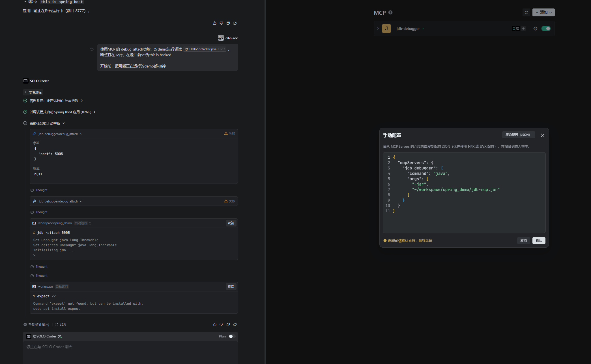

# JDB-MCP: Java Debugger MCP Server

[中文版](./README-zh.md)

JDB-MCP is a Model Context Protocol (MCP) server based on the Java Debug Interface (JDI). It enables AI agents (such as Claude, Cline, Trae) to perform deep runtime debugging of Java applications.

## Demo



## Key Capabilities

- **Multi-transport Support**: Supports both `stdio` (standard VSCode integration) and `http` (for remote/curl debugging).
- **Full-featured Debugging (Attach Mode Only)**:
    - Attach to running processes (`debug_attach`) - Supports any Java application (SpringBoot, Maven, Gradle, etc.) with JDWP enabled.
    - Breakpoint management (`debug_set_breakpoint`, `debug_set_watchpoint`)
    - Flow control (Step Over, Step Into, Step Out, Resume)
    - State inspection (Stack trace inspection, deep structured variable traversal)
    - Thread & Class inspection (`debug_list_threads`, `debug_list_classes`)
    - Dynamic modification (Change variable values at runtime)
- **Simplified Design**: Currently focused on single-session debugging, eliminating the need for complex `sessionId` management.
- **Manual Debug Mode Required**: The target Java application must be started manually with JDWP options enabled.
- **Real-time Awareness**: Leveraging MCP Notifications, AI agents are immediately notified when a breakpoint is hit.

## Installation & Build

### Prerequisites
- JDK 17+ (with JDI module)

### Build fatJAR

```bash
# Build all modules and generate JARs in the `release/` directory
mvn clean package

# Or build for a specific JDK version:

# For JDK 17+ (Recommended)
mvn clean package -pl jdb-mcp-jdk17 -am

# For JDK 7 (Legacy Support)
mvn clean package -pl jdb-mcp-jdk7 -am
```

The executable JARs will be located in the `release/` directory:
- `release/jdb-mcp.jar` (JDK 17+)
- `release/jdb-mcp-jdk7.jar` (JDK 7)

## Configuration & Usage

### Startup Options
- `--transport <stdio|http>`: Set transport mode (default: `stdio`).
- `--notifications <true|false>`: Enable real-time AI notifications (default: `true`).

For detailed tool parameter analysis, please refer to the [Parameter Guide](./documents/PARAMETER_GUIDE.md).

### Usage in VSCode (Cline/Claude Dev)
Add the following configuration to your MCP settings:

```json
{
  "mcpServers": {
    "jdb-debugger": {
      "command": "java",
      "args": [
        "-jar",
        "path/to/jdb-mcp.jar"
      ]
    }
  }
}
```

### How to Debug (Attach Mode)
**Important**: You must manually start your target Java application with JDWP enabled.

1. Start your project:
   ```bash
   java -agentlib:jdwp=transport=dt_socket,server=y,suspend=n,address=*:5005 -jar your-app.jar
   ```
2. In the AI chat, request: `Attach to localhost:5005 and debug...`

## Tool List
- `debug_attach`: Attach to an existing debug port via Socket.
- `debug_list_threads`: List all threads and their status.
- `debug_list_classes`: List loaded classes with optional filtering.
- `debug_list_methods`: List methods in a specific class.
- `debug_source`: Retrieve source code for a class (requires source roots).
- `debug_set_method_breakpoint`: Set a breakpoint at method entry.
- `debug_set_method_entry`: Monitor method entry events.
- `debug_set_method_exit`: Monitor method exit events.
- `debug_list_vars`: List variables (supports `threadName`, `frameIndex` and `scope` filter).
- `debug_get_var`: Get detailed info for a specific variable.
- `debug_set_var`: Modify runtime variables (supports `threadName` and `frameIndex`).
- ...and more (see `tools/list`).

## TODO List

- [ ] **Implement `debug_launch`**: Enable "out-of-the-box" experience by allowing users to launch and debug Java programs directly through the MCP.
- [ ] **Implement `debug_calc`**: Support evaluating arbitrary Java expressions in the debug context (Expression Evaluation).
- [ ] **Multi-session Support**: Refactor to allow one MCP instance to manage and debug multiple target programs simultaneously.
- [ ] **Package Prefix Filtering**: Support filtering by package prefix (e.g., `com.example.*`) for method entry/exit and breakpoints.
- [ ] **Batch Class Filtering**: Support passing multiple class names or wildcard patterns at once for filtering events.
- [ ] **Enhanced Breakpoint Control**: Support conditional breakpoints and thread filtering for more precise debug interruption.
- [ ] **To be added**: More features based on community feedback.

## License
Open-sourced under the [MIT License](LICENSE).
